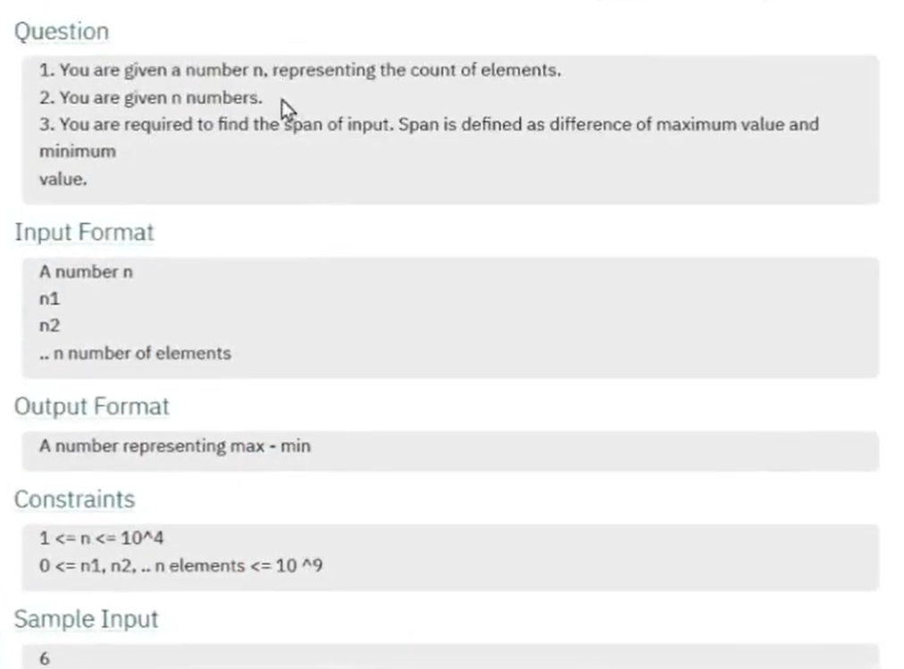
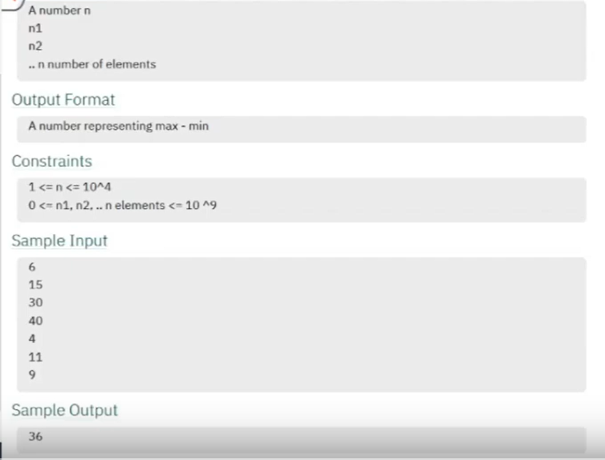
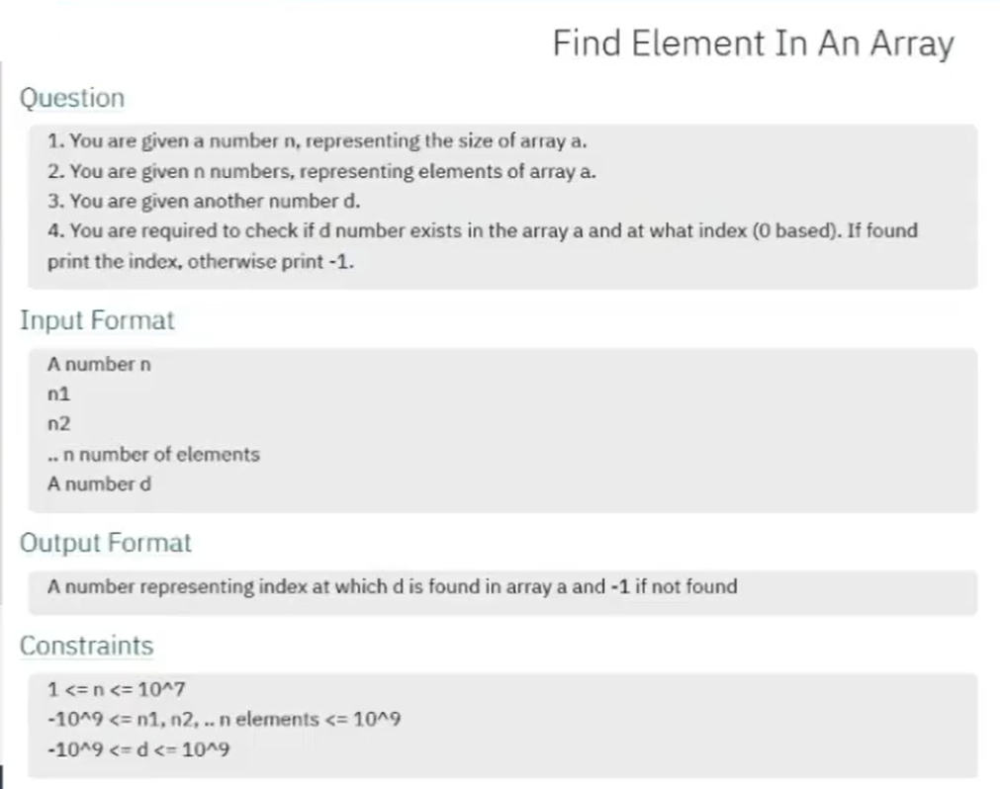
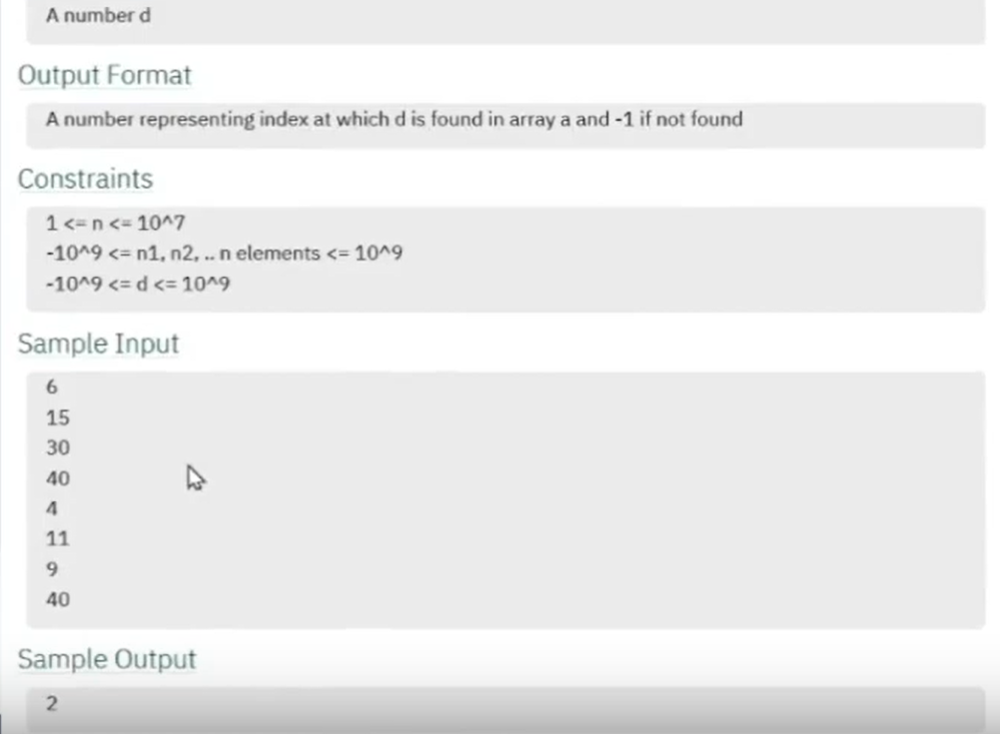
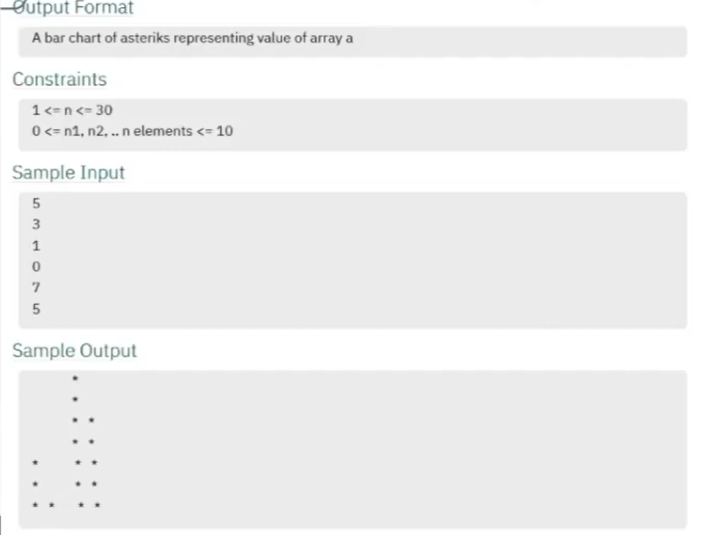
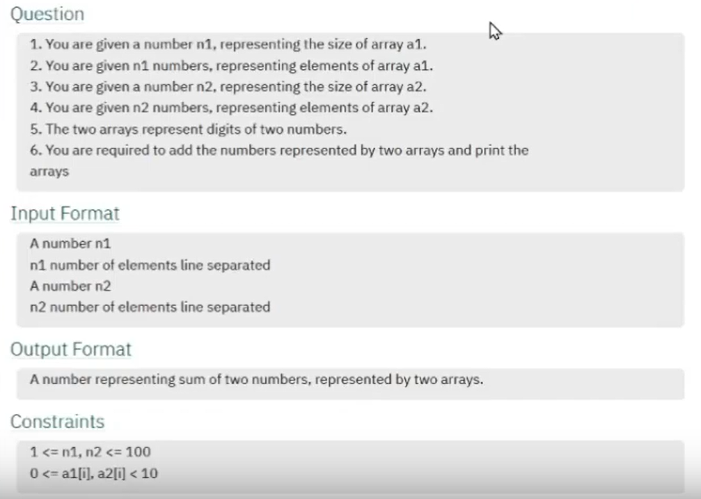
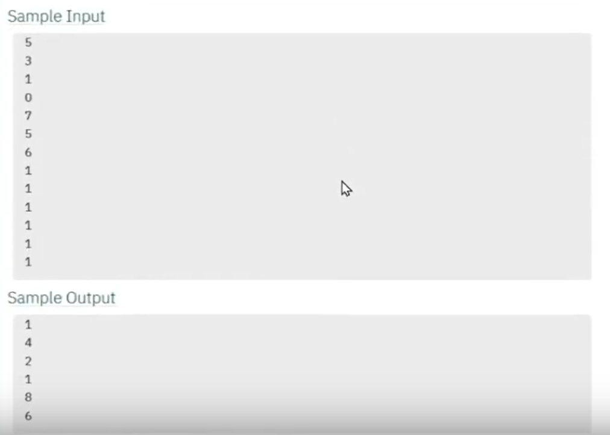
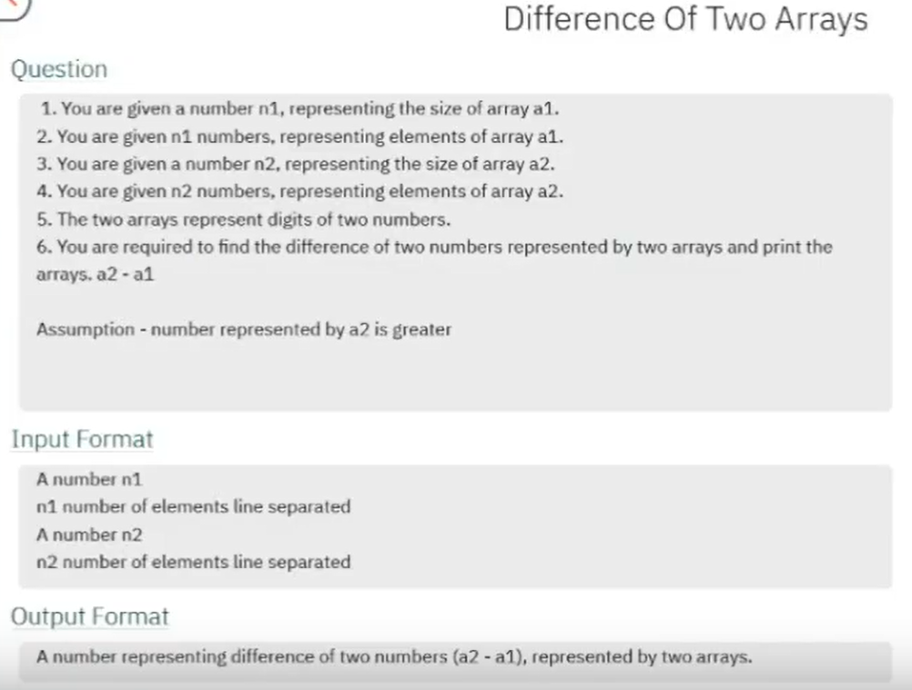

# DSA-Java - Array

#### Span of Array



#### [PC:L-93 => Que-93 & Sol-94]

```
Input Format    
int n = 6
'n' where n is any integer value.
int[] arr = new int[]{15, 30, 40, 4, 11, 9};
'arr' where arr is int array.

# E.g.
max = 40
min = 4
difference = 36

o/p:
result = 36
```

#### Find element in an array



#### [PC:L-96 => Que-96 & Sol-97]

```
Input Format    
int n = 6
'n' where n is any integer value.
which represents array length.

int[] arr = new int[]{15, 30, 40, 4, 11, 9, 40};
'arr' where arr is int array.

# E.g.

int num = 40;
arr[i] 

o/p:
result = 2
```

#### Bar Chart


#### [PC:L-97 => Que-97 & Sol-98]

```
Input Format    
int n = 5
'n' where n is any integer value.
which represents array length.

int[] arr = new int[]{3, 1, 0, 7, 5};
'arr' where arr is int array.

# E.g.

Crate a bar chart of asteriks representing value of array 'arr'.


o/p:    
            *
            *
            *   *
            *   *    
*           *   *
*           *   *
*   *       *   *
```

#### Sum of two arrays



#### [PC:L-99 => Que-99 & Sol-100]

```
Input Format    
int n1 = 5
int n2 = 6
'n1 & n2' where n1 and n2 is any integer value.
which represents array length.

int[] arr1 = new int[]{3, 1, 0, 7, 5};
int[] arr2 = new int[]{1, 1, 1, 1, 1, 1};
'arr1 & arr2' where arr is int array.

# E.g.

int[] result =  arr1 + arr2

o/p:    

result = [1, 4, 2, 1, 8, 6] 
```

#### Difference of two arrays


[//]: # (![Difference of two arrays Image]&#40;../assets/array/differenceoftwoarraysque2.png&#41;)

#### [PC:L-101 => Que-101 & Sol-102]

```
Input Format    
int n1 = 5
int n2 = 6
'n1 & n2' where n1 and n2 is any integer value.
which represents array length.

int[] arr1 = new int[]{2, 3, 4, 6, 9};
int[] arr2 = new int[]{1, 1, 1, 1, 1, 1};
'arr1 & arr2' where arr is int array.

# E.g.
int[] result =  arr2 - arr1

o/p:    
result = [8, 7, 6, 4, 2] 
```