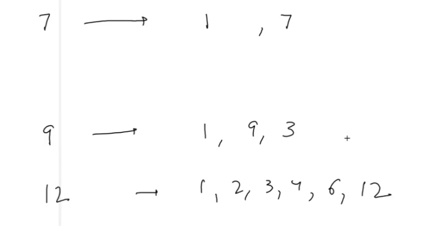
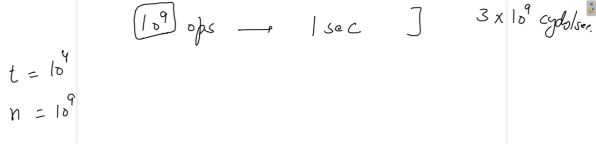
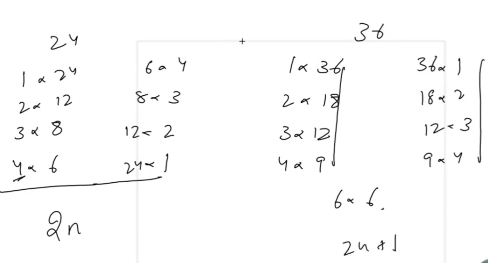

# Java Basic Programs

#### 1.1 - Is a number Prime?




```
Note:
Using above approach we can check weather number is prime or not, but this will do for small numbers.
what about for large numbers, so here t could be t = 10^4 and n could be go up to 10^9.    
```




```
# E.g.
Input Format    
int t
't' where t is any integer value. 
t (take multiple input numbers from user).

int n
'n' where n is any integer value to check n is prime or not prime.
  
Output Format
int flag;
'flag' where flag is any integer value.

Sample Input
n = 7
Sample Output
flag = 2 // => number(7) is prime. 
```

#### 1.2 - Print all Prime Numbers till N


```
# E.g.
Input Format    
int low
int high
'low' where low is any integer value. 
'high' where high is any integer value.
  
Output Format
int n1 n2 n3 
... all primes between low and high (both include)

Sample Input
low = 6
high = 24
Sample Output
7
11
13
17 
19
23
```


#### 1st - Print All Fibonacci Number Till N

```
#### [PC:Que-15 & Sol-16]  
# E.g. - 0 1 1 2 3 5 8 13 21 34 
```

#### 2nd - Count Digits in a Number

```
#### [PC:Que-17 & Sol-18]  

# E.g. Digit 
int a = 65784383;
digit count = 8.
```

### 3rd - Digits of a number

```
#### [PC:Que-19 & Sol-20]

E.g.
int n = 754 
7
5
4

Get digit count and divide n by q = Math.pow(10, count-1)-> 100 {n/q}

E.g.
d = 65784383
d1
d2
d3
...digits of the number.

Print all digit left to right with different line.
Sample Input
E.g. - 65784383
Sample Output
6
5
7
8
4
3
8
3
```

#### 4th - Reverse a Number

```
#### [PC:L-20 => Que-21 & Sol-22]  

# E.g.  
int n = 65784383
3 8 3 4 8 7 5 6
```

#### 5th - Inverse of a number


```
#### [PC:L-22 => Que-23 & Sol-24]  

# E.g.
Input Format  
int n
'n' where n is any integer value.  
int i 
'i' where i is inverted number.

Sample Input
n = 426135

Sample Output
i = 416253

Number should be according to digits (6 digit number [1-6]), it should not be miss any digit and beyond the digit.
e.g 5 digit number we have.
then n = 426135
we cannot use number like this 426137;
```

#### 6th - Rotate a number


#### [PC:L-24 => Que-25 & Sol-26]

```  
# E.g.
Input Format  
int n
'n' where n is any integer value.  
int i 
'k' where k is integer number. 
Note:- k indicates from which the number we have to rotate the number n.

Output format
int r
'r' where r is rotated number

Sample Input
n = 23457
k = 2
Sample Output
r = 57234

number format note:
n = 12340056
k = 3
r = 05612340

Note:-
if number contains '0' and kth rotation number indicates to start rotation from 0th number. 
and then we rotate the number. after that rotate number start with zero, 
then number's first zero would not show in result. 

```

#### 7th - GCD and LCM


#### [PC:L-26 => Que-27 & Sol-28]

```  
# E.g.
Input Format  
int n1
'n1' where n1 is any integer value.  
int n2 
'n2' where n2 is any integer value.

Output format
int GCD;
int LCM; 

Sample Input
n1 = 36
n2 = 24
Sample Output
GCD = 12
LCM = 72

int on1;
int on2;
on1 and on2 are contains n1 and n2 original number.

Calculate GCD and LCM (Formula)
if we have GCD or LCM
LCM(n1, n2) = (n1 * n2) / GCD(n1, n2)

```

#### 8th - Prime Factorization


#### [PC:L-28 => Que-29 & Sol-30]

```  
# E.g.
Input Format    
int n
'n' where n is any integer value.  

Output Format
p1 p2 p3 p4.... All prime factors of n.

Sample Input
n = 1440
Sample Output
int a = 2 2 2 2 2 3 3 5
```

#### 9th - Pythagorean Triplets


#### [PC:L-30 => Que-31 & Sol-32]

```  
# E.g.
Input Format    
int a
int b
int c
'a','b' and 'c' where a,b, and c is any integer value.  

Note:- a is the perpendicular, b is the base and c is the hypotenuse of the right-angled triangle.

Output Format
int isPythagoreanTriplets;

Sample Input
a = 5 
b = 3
c = 4 
Sample Output
boolean isPythagoreanTriplets = true

First find out the max value from a,b and c.

1st
int max = a;
if(b>=max){
max = b;
}
if(c>=max){
max = c;
}

2nd 
private static int findMax(int a, int b, int c) {
        if (a > b && a > c) {
            return a;
        } else if (b > c || b > a) {
            return b;
        } else {
            return c;
        }
    }

Note:- Formula to calculate Pythagorean Triplets
int isPythagoreanTriplets [a2+b2 = c2]

if max is a, b or c;
then compare the square of values according to max value.

        boolean flag;
        if (max == a) {
            flag = (sqaure of B + sqaure of C) == square of A;
        } else if (max == b) {
            flag = (sqaure of C + square of A) == sqaure of B;
        } else {
            flag = ((square of A + sqaure of B) == ((sqaure of C));
        }        
```

#### 10th - Benjamin Bulbs




#### [PC:L-32 => Que-33 & Sol-34]

```  
# E.g.
Input Format    
int n
'n' where n is any integer value.  

Print all perfect square of all numbers till n, which will be less than n.
```

#### Introduction to Functions

[//]: # (![Introduction to Functions]&#40;../assets/introductiontofunctions.png&#41;)

#### [PC:L-74]

```  
# E.g.
Input Format    
int n
int r
'n' where n is any integer value.
'r' where r is any integer value.

find the npr.
```

#### Digits Frequency

#### [PC:L-76 => Que-76 & Sol-77]
```  
Input Format    
int n
int d 
'n' where n is any integer value.
'd' where d is digit.  


# E.g.
n = 994543234
d = 4

o/p:
result = 3
```


### Introduction to Number System
#### Decimal to any Base [Conv_1_DecimalToAnyBase]

#### [PC:L-79 => Que-79 & Sol-80]
```  
Input Format    
int n
int b 
'n' where n is any integer value.
'b' where b is base to convert the number.  


# E.g.
n = 634
b = 2 || 8

o/p:
result = 1001111010 || 1172
```