# Java Basic Pattern

#### 1st - Pattern-1

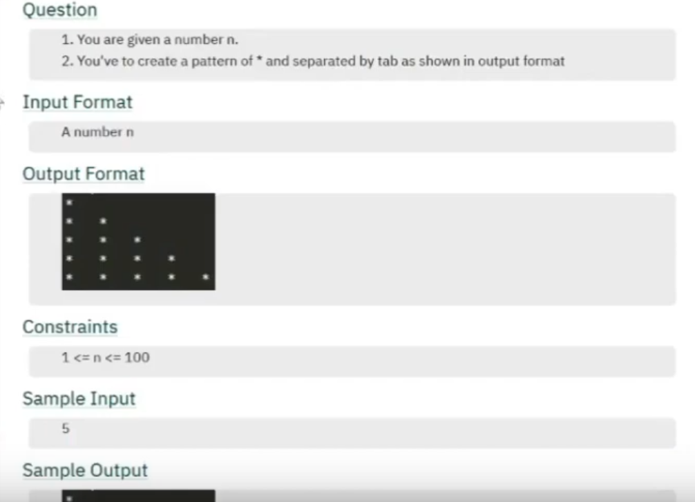


```
Input Format
int n = 5;

Output Format
*
*   *
*   *   *
*   *   *   *
*   *   *   *   *
```

#### 2nd - Pattern-2

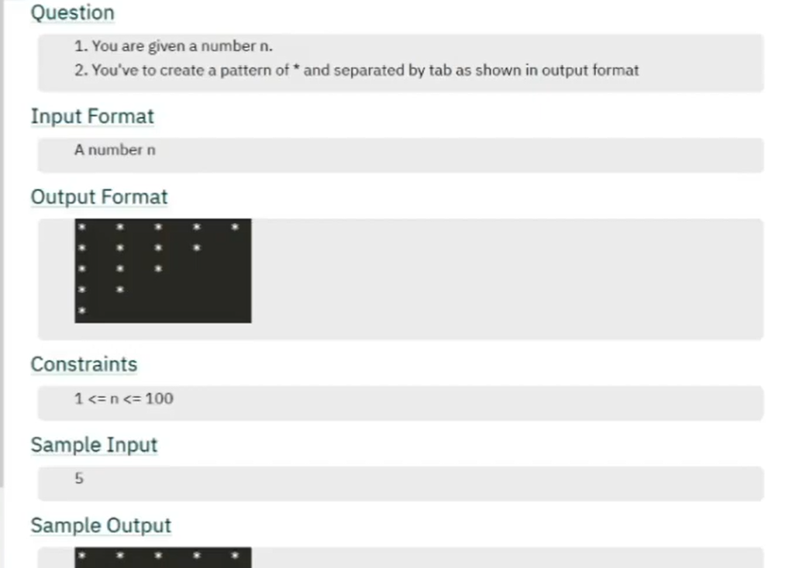
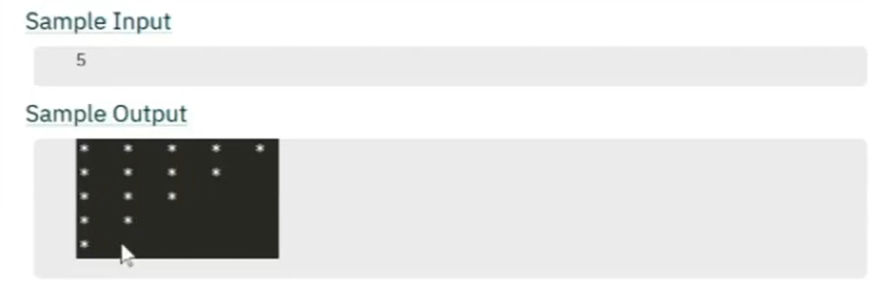

```
Input Format
int n = 5;

Output Format
*   *   *   *   *
*   *   *   *
*   *   *
*   *
*
```

#### 3rd - Pattern-3

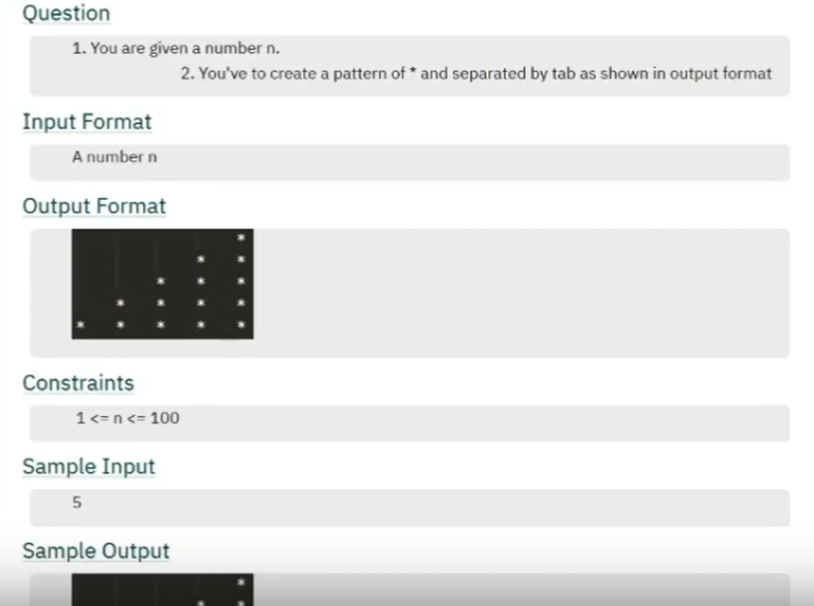

```
Input Format
int n = 5;

Output Format
                *
            *   *
        *   *   *
    *   *   *   *
*   *   *   *   *
```

#### 4th - Pattern-4

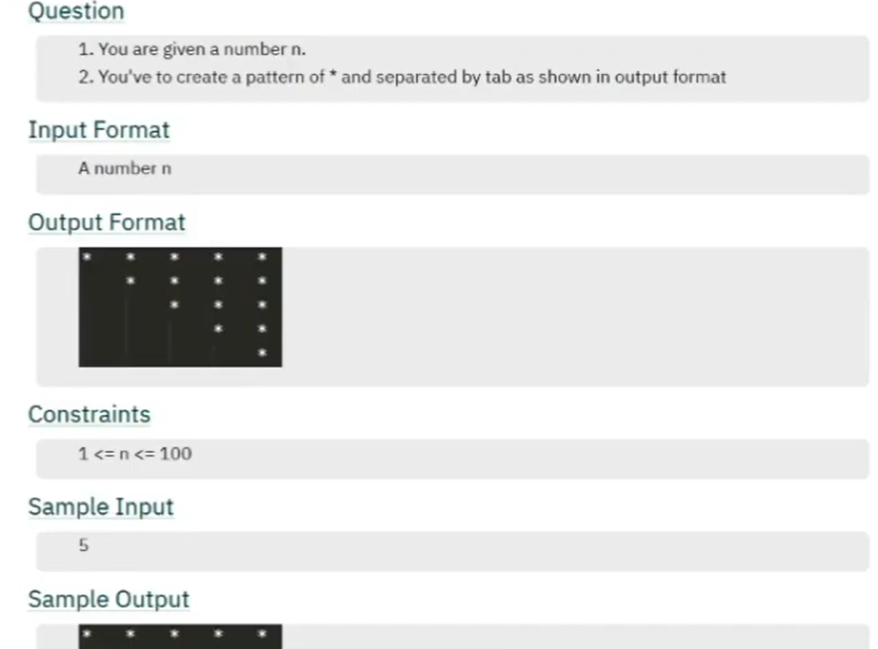


```
Input Format
int n = 5;

Output Format
*   *   *   *   *
    *   *   *   *
        *   *   *
            *   *
                *                
```

#### 5th - Pattern-5
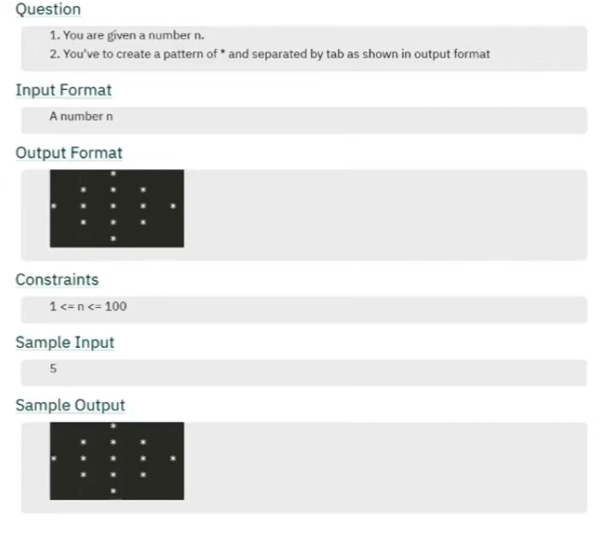

```
Input Format
int n = 5;

Output Format
        *
    *   *   *                     
*   *   *   *   *
    *   *   *
        *
```

#### 6th - Pattern-6
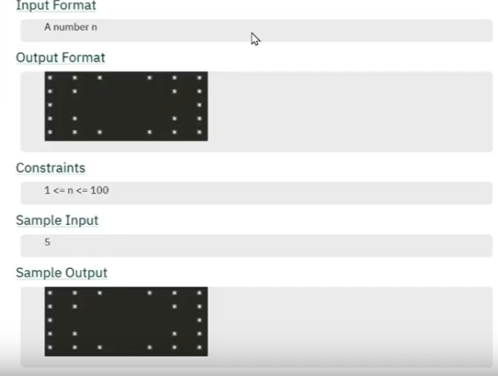

```
Input Format
int n = 5;

Output Format

*   *   *       *   *   *
*   *               *   *
*                       *
*   *               *   *
*   *   *       *   *   *   

```

#### 7th - Pattern-7
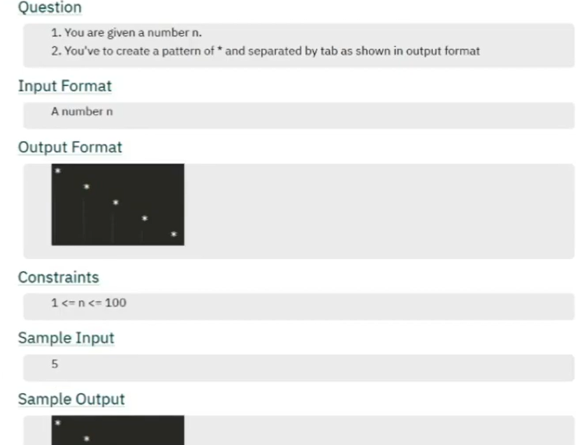

```
Input Format
int n = 5;

Output Format

*   
    *
        *
            *
                *   

11  12  13  14  15   
*   *   *   *   *
21  22  23  24  25
*   *   *   *   *
31  32  33  34  35
*   *   *   *   *
41  42  43  44  45
*   *   *   *   *
51  52  53  54  55
*   *   *   *   *


(i == j)

```

#### 8th - Pattern-8
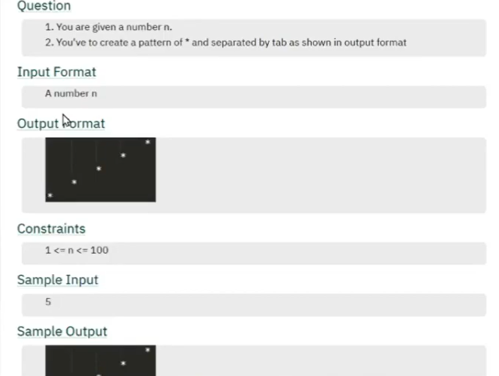
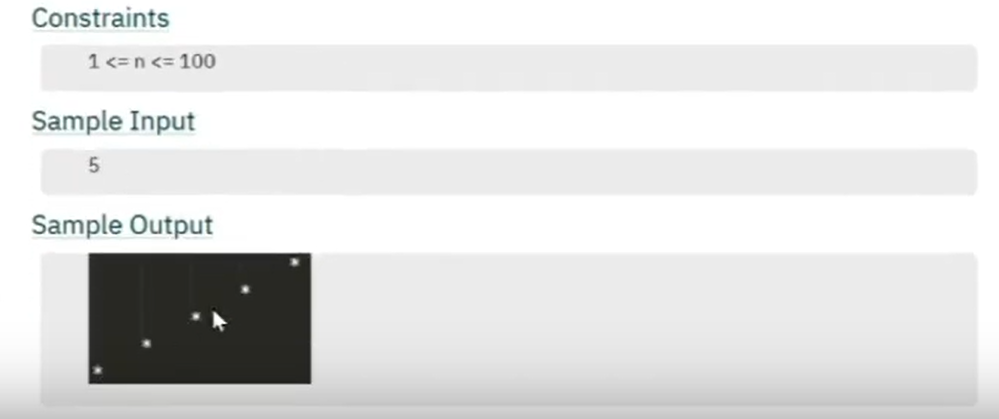

```
Input Format
int n = 5;

Output Format
  
                *
            *                   
        *
    *
*
    
    j
i   1   2   3   4   5   
1   *   *   *   *   *
2   *   *   *   *   *
3   *   *   *   *   *
4   *   *   *   *   *
5   *   *   *   *   *


(i + j == n + 1)

```

#### 9th - Pattern-9
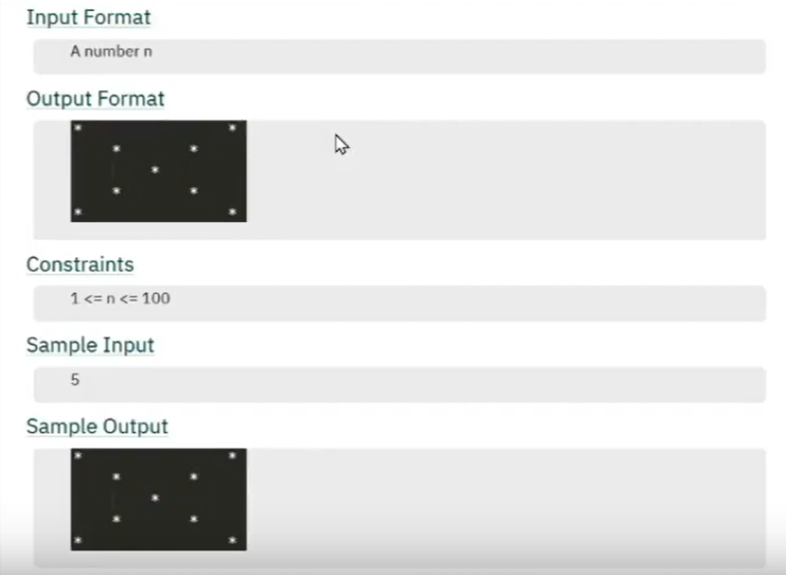

```
Input Format
int n = 5;

Output Format

*               *
    *       *
        *
    *       *
*               *


((i == j) && (i + j == n + 1))
```

#### 10th - Pattern-10
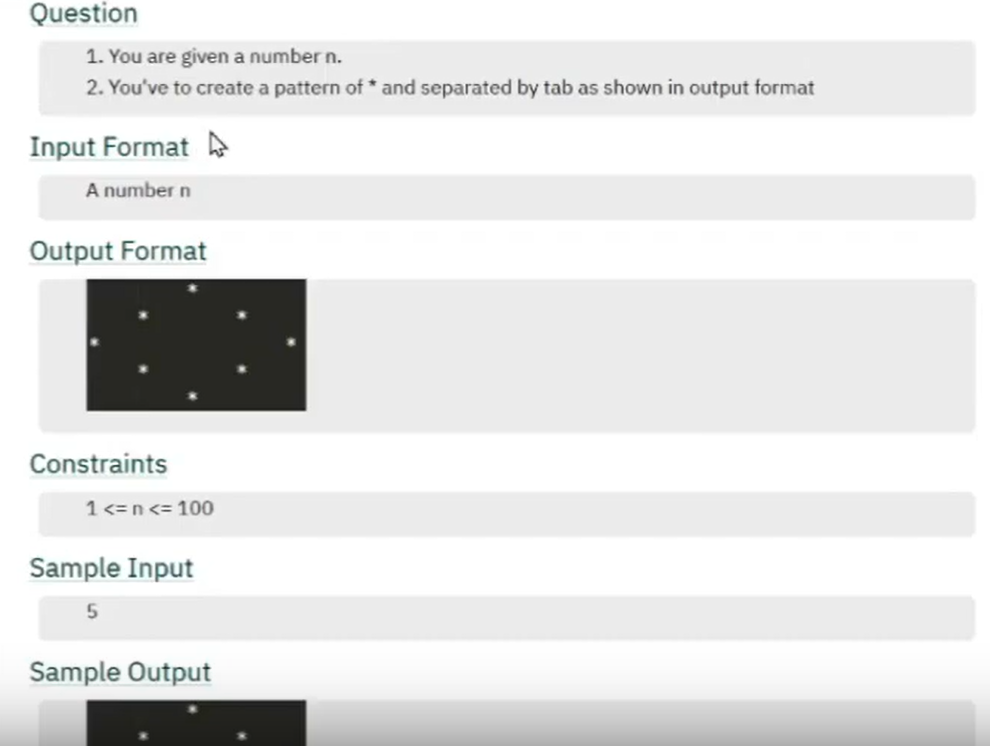
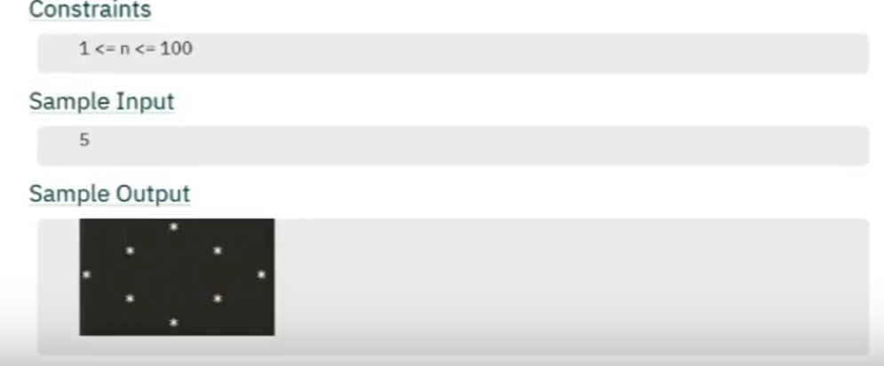

```
Input Format
int n = 5;

Output Format

        *
    *       *
*               *           
    *       *
        *
        
Note:-
Manage Outer Space and Inner Space
is      os
2       -1
1        1
0        3
1        1   
2       -1

print outer space then star(without iteration) after that inner space again star(with condition).

if (i <= n / 2) {
    sp1--;
    sp2 += 2;
  } else {
    sp1++;
    sp2 -= 2;
  }
        
```
