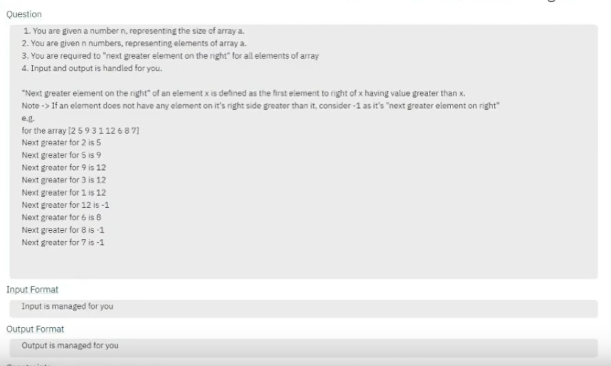

# DSA-Java

## Stack

### Stack Using Array

### Stack Using Dynamic Array

### Stack Using Linked List

#### Introduction to Stacks

## Java Stack Introduction

```
Stack<Integer> stack = new Stack<>();   
```

#### Duplicate Brackets


#### [PC:L-104 => Que-104 & Sol-105]

```
e.g.
String exp1 = "((a+b)+(c+d))" -> false
String exp2 = "(a+b)+((c+d))" -> true

Input format
A String str/exp
   
Output format
true or false

Sample Input
(a+b)+((c+d))

Sample Output
true   
```

#### Duplicate Brackets Stack Using Linked List

    Linked List -> Node and Data

#### Balanced Brackets


#### [PC:L-106 => Que-106 & Sol-107]

```
e.g.
String exp1 = "[(a+b)+{(c+d)*(e/f)}]";  -> true
String exp2 = "[a+b)+{(c+d)*(e/f)]}";   -> false
String exp3 = "[(a+b)+{(c+d)*(e/f)}";   -> false
String exp4 = "([(a+b)+{(c+d)*(e/f)}]"; -> false


Input format
A String str/exp
   
Output format
true or false

Sample Input
[(a+b)+{(c+d)*(e/f)}]

Sample Output
true   
```

#### NextGreaterElementOnTheRight



#### [PC:L-108 => Que-108 & Sol-109]

```
e.g.
int[] arr = new int[]{2,5,9,3,1,12,6,8,7}; 

Next greater element for 2 is 5.
Next greater element for 5 is 9.
Next greater element for 2 is 5.
Next greater element for 9 is 12.
Next greater element for 3 is 12.
Next greater element for 1 is 12.
Next greater element for 12 is -1.
Next greater element for 6 is 8.
Next greater element for 8 is -1.
Next greater element for 7 is -1.


Input format
int[] arr = new int[]{2,5,9,3,1,12,6,8,7};
2 5 9 3 1 12 6 8 7 
 
Output format
int[] nge = new int[n];
5 9 12 12 12 -1 8 -1 -1

Sample Input
int[] arr = new int[n];
2 5 9 3 1 12 6 8 7 

Sample Output
int[] nge = new int[n];
5 9 12 12 12 -1 8 -1 -1
```

#### Next Greater Element On The Right Alternative Solution

```
e.g.
int[] arr = new int[]{2,5,9,3,1,12,6,8,7}; 
```

