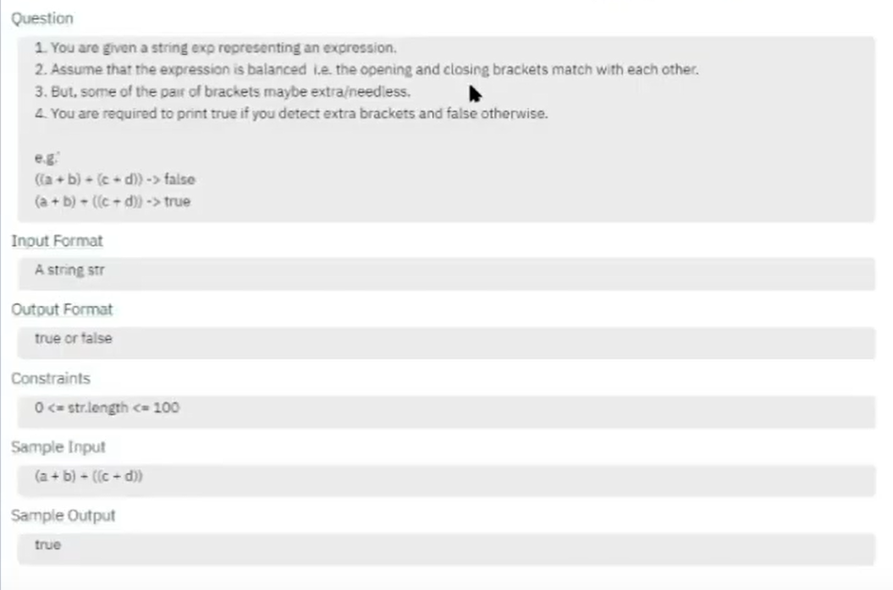
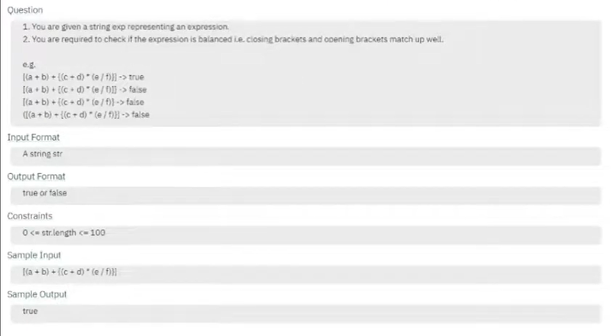
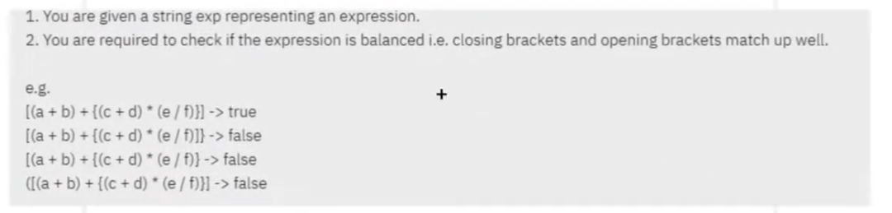

# DSA-Java

## Stack

### Stack Using Array

### Stack Using Dynamic Array

### Stack Using Linked List

#### Introduction to Stacks

## Java Stack Introduction

```
Stack<Integer> stack = new Stack<>();   
```

#### Duplicate Brackets



#### [PC:L-104 => Que-104 & Sol-105]

```
e.g.
String exp1 = "((a+b)+(c+d))" -> false
String exp2 = "(a+b)+((c+d))" -> true

Input format
A String str/exp
   
Output format
true or false

Sample Input
(a+b)+((c+d))

Sample Output
true   
```

#### Duplicate Brackets Stack Using Linked List
    Linked List -> Node and Data

#### Balanced Brackets




#### [PC:L-106 => Que-106 & Sol-107]

```
e.g.
String exp1 = "[(a+b)+{(c+d)*(e/f)}]";  -> true
String exp2 = "[a+b)+{(c+d)*(e/f)]}";   -> false
String exp3 = "[(a+b)+{(c+d)*(e/f)}";   -> false
String exp4 = "([(a+b)+{(c+d)*(e/f)}]"; -> false


Input format
A String str/exp
   
Output format
true or false

Sample Input
[(a+b)+{(c+d)*(e/f)}]

Sample Output
true   
```
